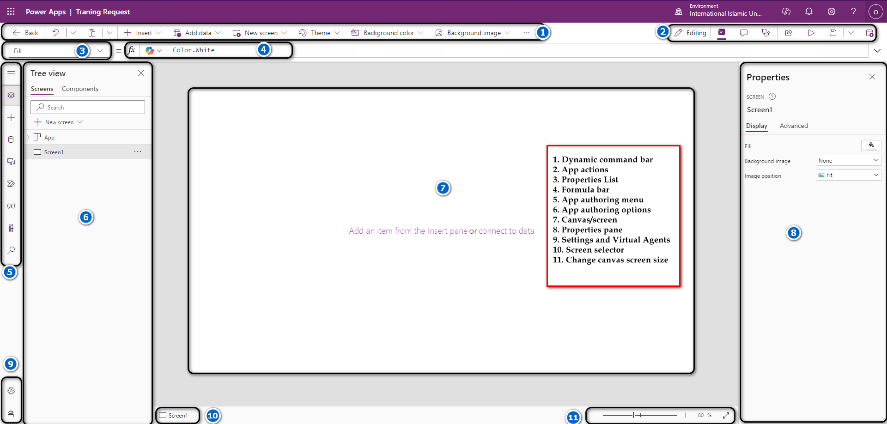

## Canvas overview

1. Dynamic command bar: Dynamic command bar that shows a different set of commands based on the control selected.

2. App actions: Options to rename, share, run the app checker, add comments, preview, save, or publish the app.

3. Properties list: List of properties for the selected object.

4. Formula bar: Compose or edit a formula for the selected property with one or more functions.

5. App authoring menu: Selection pane to switch between data sources and insert options.

6. App authoring options: Details pane with options relevant to the selected menu item for authoring the app.

7. Canvas/screen: Primary canvas for composing the app structure.

8. Properties pane - properties list for the selected object in UI format.

9. Settings and virtual agent: Go to the settings or get help building your app from a virtual agent.

10. Screen selector: Switch between different screens in an app.

11. Change canvas screen size: Change the size of the canvas during an authoring experience in Power Apps Studio.

https://learn.microsoft.com/en-us/power-apps/maker/canvas-apps/power-apps-studio